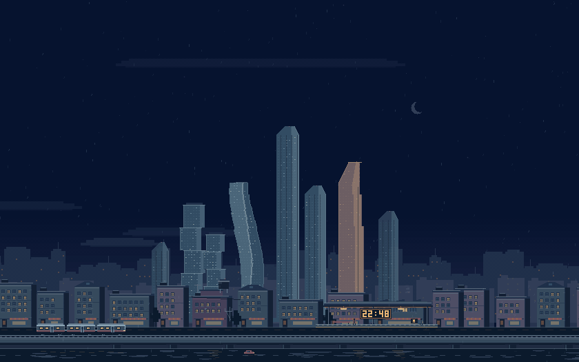
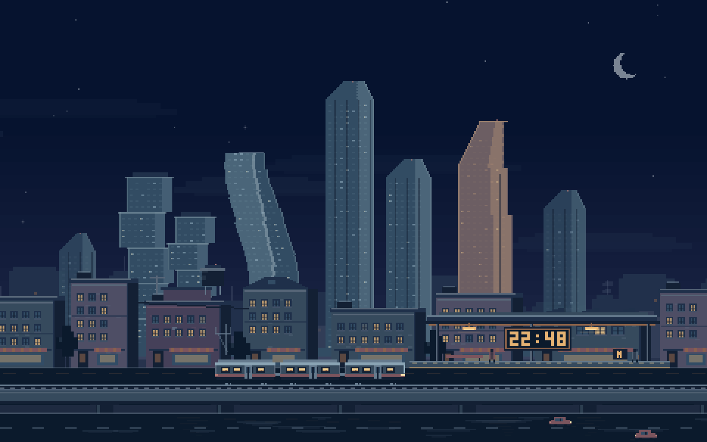
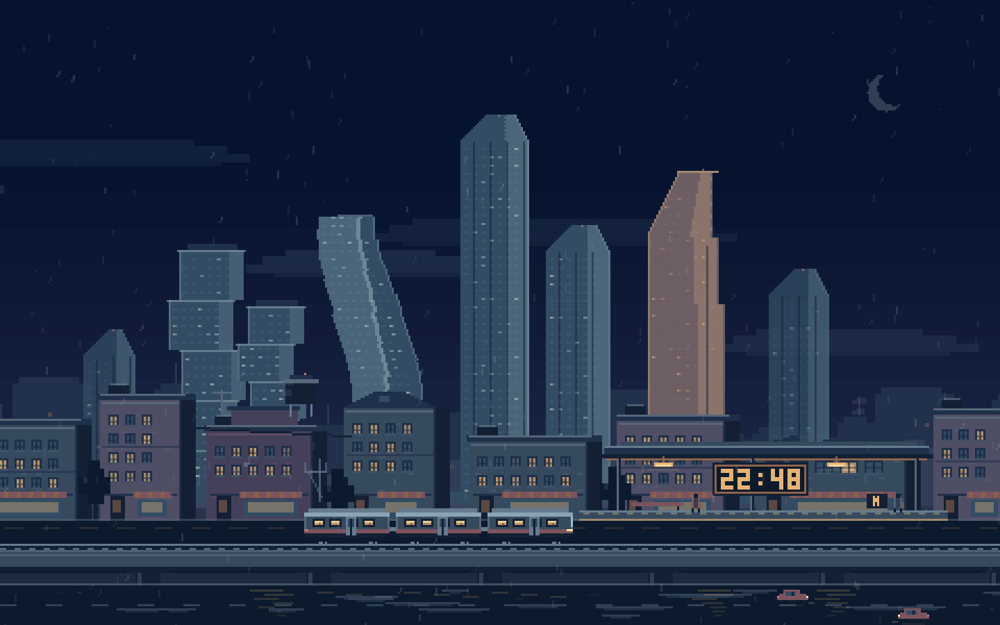
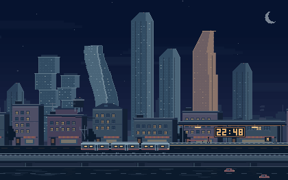

# Живой пиксельный город

[Общая инструкция на русском](../README.ru.md) · [English README](../README.md) · [MIT](../LICENSE)

Быстрые команды из корня репозитория:

```sh
./scripts/build.sh city preview
./scripts/build.sh city
./scripts/check.sh city
./scripts/install.sh city
```

Настоящий модуль macOS `.saver`: ночная панорама с небоскрёбами, вдохновлёнными Москва-Сити, тёплыми окнами, небольшой станцией и редкими машинами. Город виден издалека: жилые кварталы, башни и дальние здания образуют несколько планов. Это художественная сцена с вымышленной планировкой. На станционном табло показывается настоящее местное время в 24-часовом формате **ЧЧ:ММ**. Палитра сочетает тёмно-синий и фиолетовый с янтарным светом и холодными акцентами дождя.

Силуэты вдохновлены [Федерацией](https://www.citymoscow.ru/towers/bashnya-federaciya/), [Эволюцией](https://www.citymoscow.ru/towers/evolution/), [Меркурием](https://www.citymoscow.ru/towers/merkuriy/) и [Городом Столиц](https://www.citymoscow.ru/towers/gorod-stolic/). Это вымышленный ракурс; архитектура стилизована и нарисована кодом. Изображения из источников в проекте не используются.

Графика полностью нарисована кодом. В проекте нет сторонних изображений, игровых ассетов, сетевых запросов или внешних зависимостей. Требуется macOS **13.0 или новее**; текущая версия — **0.2.0**.

## Жизнь города

Каждое окно следует собственному случайному расписанию: оно сохраняет состояние на 20–110 секунд, затем плавно меняет освещение за 3,5–8,5 секунды. Начальные моменты смены разнесены; окна не переключаются общей волной и не повторяют короткую зацикленную анимацию.

Первый поезд появляется примерно через пять секунд. Проход занимает 12–16 секунд, после чего следует пауза 30–65 секунд. Направление и число вагонов меняются между проходами: по станции проходят составы из трёх или четырёх освещённых вагонов.

По двум полосам дороги иногда проезжают машины с фарами и задними огнями. У каждой полосы собственное расписание: проезд занимает 9–14 секунд, пауза — 20–40 секунд. Направления встречные, цвета и силуэты машин меняются. Движение не начинается одновременно и не образует непрерывный поток.

Погода медленно переходит между ясной ночью, облачностью и дождём. Каждый переход длится 25–45 секунд; новое состояние сохраняется 60–140 секунд. После дождя отражения постепенно ослабевают, поэтому мокрый асфальт не высыхает мгновенно. Движение облаков, дымок, редкие прохожие и огни крыш дополняют сцену.

Модель хранит ограниченное число окон и расписаний. Случайные значения обновляются при событиях, а не для каждого окна в каждом кадре. После сна Mac или паузы предпросмотра анимация продолжает текущую сцену без проигрывания всех пропущенных событий.



| Ясная ночь | Дождь |
| --- | --- |
|  |  |



## Пиксели и размеры экрана

Сцена сначала рисуется в небольшом растровом буфере. Размер каждого художественного пикселя равен целому числу физических пикселей дисплея; увеличение выполняется методом ближайшего соседа без сглаживания. Края домов, текст, дождь и фигуры используют одну сетку, включая Retina-дисплеи.

Основные башни и станция остаются в центре. На широких экранах город продолжается по краям, а на высоких над панорамой остаётся больше неба. Композиция перестраивается при изменении размера окна; силуэты небоскрёбов и табло сохраняются целиком.

## Сначала посмотрите предпросмотр

1. Откройте [PixelCity.xcodeproj](PixelCity.xcodeproj) в Xcode.
2. Выберите схему **PixelCityPreview** и устройство **My Mac**.
3. Нажмите **Run** (`⌘R`). Размер окна можно свободно менять.
4. `⌘1` включает маленький предпросмотр 420×263; `⌘2` возвращает обычное окно. `⌃⌘F` включает полный экран.
5. В меню **Погода** доступны естественная смена (`⌘0`), ясная ночь (`⌘3`), облачность (`⌘4`) и дождь (`⌘5`). Эти переключатели помогают оценить графику; установленная заставка использует естественную смену погоды.

Предпросмотр и `.saver` используют один `ScreenSaverView`, модель и код рисования из `Shared/`. Предварительно устанавливать заставку для просмотра не требуется.

Если активным developer directory остаются Command Line Tools, Xcode можно выбрать для одной команды:

```sh
DEVELOPER_DIR=/Applications/Xcode.app/Contents/Developer xcodebuild \
  -project City/PixelCity.xcodeproj \
  -scheme PixelCityPreview \
  -configuration Debug \
  -destination 'platform=macOS' \
  -derivedDataPath build/city \
  build
```

Все команды ниже также запускаются из корня репозитория.

## Проверка анимации

Модель можно проверить без запуска окна:

```sh
mkdir -p build
DEVELOPER_DIR=/Applications/Xcode.app/Contents/Developer xcrun swiftc -O \
  -module-cache-path build/CityModuleCache \
  City/Shared/CitySceneModel.swift City/Tools/TestCityScene.swift \
  -o build/test-city-scene
build/test-city-scene
```

Тест проверяет независимость и плавность окон, границы состояний, расписание поездов и машин, смену погоды, сохранение влажности, восстановление после скачка времени и 30 минут непрерывной симуляции. Фиксированные seed делают проверку воспроизводимой.

Кадры разных размеров создаются из того же view, который использует модуль:

```sh
DEVELOPER_DIR=/Applications/Xcode.app/Contents/Developer xcrun swiftc \
  -framework AppKit -framework ScreenSaver \
  -module-cache-path build/CityModuleCache \
  City/Shared/CitySceneModel.swift City/Shared/CityArtworkView.swift \
  City/Shared/PixelCitySaverView.swift City/Tools/RenderCitySnapshots.swift \
  -o build/render-city-snapshots
build/render-city-snapshots
```

Снимки сохраняются в `build/city-snapshots/`: 420×263, 1440×900, 1920×1080, 2560×1080 и 900×1440, а также отдельные кадры облачности и дождя. В этих кадрах время зафиксировано на 22:48 для повторяемости; живая заставка показывает текущее местное время.

Для покадровой проверки поезда, машин и дождя есть `Tools/RenderCityAnimation.swift`: он создаёт 120 кадров за десять секунд при 12 кадрах в секунду, начиная с восьмой секунды сцены.

```sh
DEVELOPER_DIR=/Applications/Xcode.app/Contents/Developer xcrun swiftc \
  -framework AppKit -framework ScreenSaver \
  -module-cache-path build/CityModuleCache \
  City/Shared/CitySceneModel.swift City/Shared/CityArtworkView.swift \
  City/Shared/PixelCitySaverView.swift City/Tools/RenderCityAnimation.swift \
  -o build/render-city-animation
build/render-city-animation
```

PNG-кадры сохраняются в `build/city-animation-frames/`. GIF выше собран из этих кадров.

Заставка обновляется 30 раз в секунду. В измерении на этом Mac отрисовка обновлённой панорамы с дождём без записи PNG заняла:

| Размер | Медиана кадра | 95-й процентиль |
| --- | --- | --- |
| 1440×900 | 4,27 мс | 4,58 мс |
| 2560×1080 | 6,58 мс | 6,92 мс |

Это измерение рисования в памяти; оно не включает работу системного ScreenSaverEngine. Для воспроизведения есть `Tools/BenchmarkCity.swift`:

```sh
DEVELOPER_DIR=/Applications/Xcode.app/Contents/Developer xcrun swiftc -O \
  -framework AppKit -framework ScreenSaver \
  -module-cache-path build/CityModuleCache \
  City/Shared/CitySceneModel.swift City/Shared/CityArtworkView.swift \
  City/Shared/PixelCitySaverView.swift City/Tools/BenchmarkCity.swift \
  -o build/benchmark-city
build/benchmark-city
```

## Сборка модуля

Универсальная сборка для Apple Silicon и Intel:

```sh
DEVELOPER_DIR=/Applications/Xcode.app/Contents/Developer xcodebuild \
  -project City/PixelCity.xcodeproj \
  -scheme PixelCity \
  -configuration Release \
  -destination 'generic/platform=macOS' \
  -derivedDataPath build/city \
  ARCHS='arm64 x86_64' \
  build
```

Результат: `build/city/Build/Products/Release/PixelCity.saver`.

Для установки или обновления в своей учётной записи после просмотра выполните:

```sh
mkdir -p "$HOME/Library/Screen Savers"
ditto build/city/Build/Products/Release/PixelCity.saver \
  "$HOME/Library/Screen Savers/PixelCity.saver"
```

Откройте **Системные настройки**, найдите раздел **Заставка** через поиск и выберите **«Живой пиксельный город»** (`PixelCity`). Если заменили уже установленный модуль, закройте и снова откройте Системные настройки.

## Публикация

В Git храните исходники, проект Xcode, этот README и изображения из `docs/`. Корневой `.gitignore` исключает `build/`, `DerivedData/`, собранные `.app` и `.saver`, пользовательские настройки Xcode и ключи подписи. Готовые модули можно распространять отдельными выпусками; для удобной установки на другие Mac понадобятся подпись Developer ID и нотариализация. Закрытые ключи и учётные данные подписи в публичный репозиторий добавлять нельзя.
