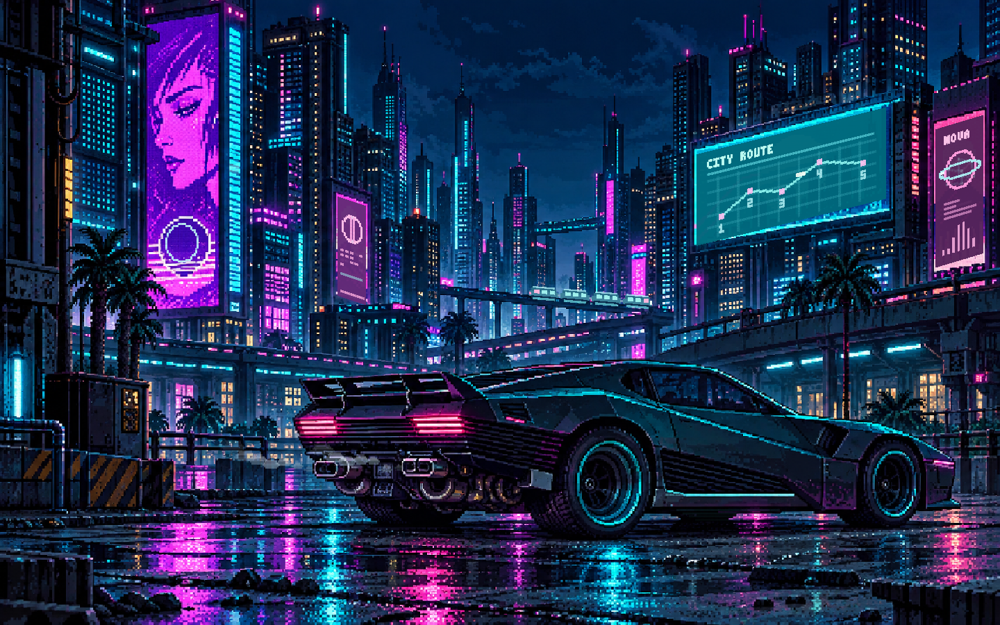
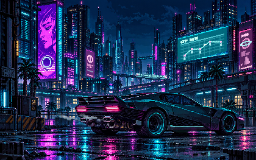

# Неоновый квартал

[Общая инструкция на русском](../README.ru.md) · [English README](../README.md) · [MIT](../LICENSE)

Быстрые команды из корня репозитория:

```sh
./scripts/build.sh neon preview
./scripts/build.sh neon
./scripts/check.sh neon
./scripts/install.sh neon
```

Отдельный модуль macOS `.saver`: ночной квартал в пиксельной стилистике киберпанка. Неоновые фасады и рекламные экраны уходят в глубину, на мокрой дороге стоит низкий угловатый автомобиль. Переднего персонажа в композиции нет. Экраны на зданиях меняют изображения и показывают собственные анимации, подсветка машины мягко оживает, из выхлопных труб поднимается заметный дым. По дальней эстакаде время от времени проходит футуристичный поезд.

Заставка вдохновлена присланным визуальным референсом и атмосферой футуристического мегаполиса. Основная иллюстрация создана с помощью генерации изображений; поверх неё работает анимация, нарисованная кодом. Сведения об иллюстрации и запросе для её создания находятся в [Resources/ARTWORK.md](Resources/ARTWORK.md). Исходный скриншот из игры не входит в репозиторий.

Ресурс [Resources/neon-district.png](Resources/neon-district.png) включён в приложение и модуль: во время работы не нужны сеть, внешние сервисы или загрузка изображений. Требуется macOS **13.0 или новее**. Версия — **0.2.0**.






Иллюстрация сохраняет пропорции и показывается целиком: машина и основные рекламные экраны не обрезаются. Внутренний растр сцены увеличен с 640×400 до 1152×720: пиксель стал меньше, а исходная иллюстрация сохраняет больше деталей. На очень широких и высоких экранах свободное место занимает спокойный фон с пиксельными силуэтами, небом и дорожными отражениями. Увеличение выполняется без сглаживания.

Первый поезд появляется примерно через 6 секунд после запуска. Состав из трёх или четырёх вагонов проходит эстакаду за 7–10 секунд, затем следует пауза 35–65 секунд; направление выбирается для каждого проезда. Рекламные экраны независимо удерживают изображение 14–38 секунд и плавно меняют его за 2,5–5 секунд.

На большом бирюзовом экране чередуются вращающийся куб, орбитальная схема, живой эквалайзер и маршрут с движущейся точкой. На правом розовом экране вращаются голограммы и движутся столбики, на небольшом экране в глубине вращается сфера и проходит световая полоса. У портрета слева оживает круглый знак, а по соседней узкой панели проходит подсветка. Дым стал светлее и крупнее, его клубы постепенно поднимаются и уходят влево.

## Сначала посмотрите предпросмотр

1. Откройте [NeonDistrict.xcodeproj](NeonDistrict.xcodeproj) в Xcode.
2. Выберите схему **NeonDistrictPreview** и устройство **My Mac**.
3. Нажмите **Run** (`⌘R`). Размер окна можно свободно менять.
4. `⌘1` включает маленькое окно, `⌘2` возвращает обычный размер. `⌃⌘F` включает полный экран.

Предпросмотр и `.saver` используют общий код сцены из `Shared/`. Устанавливать заставку для просмотра не требуется.

Если активным developer directory остаются Command Line Tools, выберите Xcode для одной команды. Все команды ниже запускаются из корня репозитория.

```sh
DEVELOPER_DIR=/Applications/Xcode.app/Contents/Developer xcodebuild \
  -project Neon/NeonDistrict.xcodeproj \
  -scheme NeonDistrictPreview \
  -configuration Debug \
  -destination 'platform=macOS' \
  -derivedDataPath build/neon \
  build
```

## Сборка и установка

Универсальная сборка для Apple Silicon и Intel:

```sh
DEVELOPER_DIR=/Applications/Xcode.app/Contents/Developer xcodebuild \
  -project Neon/NeonDistrict.xcodeproj \
  -scheme NeonDistrict \
  -configuration Release \
  -destination 'generic/platform=macOS' \
  -derivedDataPath build/neon \
  ARCHS='arm64 x86_64' \
  build
```

Результат: `build/neon/Build/Products/Release/NeonDistrict.saver`.

После просмотра установите модуль в своей учётной записи:

```sh
mkdir -p "$HOME/Library/Screen Savers"
ditto build/neon/Build/Products/Release/NeonDistrict.saver \
  "$HOME/Library/Screen Savers/NeonDistrict.saver"
```

Откройте **Системные настройки**, найдите раздел **Заставка** через поиск и выберите **«Неоновый квартал»** (`NeonDistrict`). При обновлении уже установленного модуля закройте и снова откройте Системные настройки.

Это самостоятельная заставка с отдельными проектом, именем и идентификатором модуля. `PixelCity` можно выбирать независимо.

## Проверка

Debug-предпросмотр и универсальный Release-модуль собраны. Модуль содержит архитектуры `arm64` и `x86_64`; его bundle загружается, а главный класс распознаётся как `ScreenSaverView`. В обеих сборках присутствует исходная иллюстрация. Общий код рисования проверен снимками 420×263, 1440×900, 1920×1080, 2560×1080, 900×1440, 3024×1890 и 3840×2160. Последние два размера проверяют реальное число пикселей во внеэкранном буфере с масштабом 1×. Обновлённый GIF содержит 18 секунд анимации при 12 кадрах в секунду, начиная с четвёртой секунды сцены: в нём видны первый поезд и переходы экранов.

Эти проверки выполнены без запуска окна и установленной заставки в системном `ScreenSaverEngine`. Минимальная версия macOS в проекте — 13.0; запуск на этой версии отдельно не проверялся.

Автоматическая проверка моделирует 30 минут анимации: пять рекламных экранов независимо меняют состояния, переходы и подсветка машины остаются плавными, состояния не выходят за границы. За проверенный интервал проходит 30 поездов в обоих направлениях. Также проверяются одинаковые результаты при 30 и 60 кадрах в секунду, восстановление после сна и ограниченная обработка больших скачков времени.

```sh
mkdir -p build
DEVELOPER_DIR=/Applications/Xcode.app/Contents/Developer xcrun swiftc -O \
  -module-cache-path build/NeonModuleCache \
  Neon/Shared/NeonAnimationModel.swift Neon/Tools/TestNeonAnimation.swift \
  -o build/test-neon-animation
build/test-neon-animation
```

Заставка обновляется 30 раз в секунду. При измерении на этом Mac общий view рисовался в растровый буфер с масштабом 1×; каждый результат рассчитан по 60 кадрам после первого рисования и подготовки кеша. Замер выполнен до последнего усиления яркости дыма, с той же геометрией и числом клубов. Декодирование PNG на первом кадре, запись файлов и работа системного окна в измерение не входят.

| Размер | Медиана кадра | 95-й процентиль |
| --- | --- | --- |
| 1440×900 | 4,666 мс | 5,355 мс |
| 2560×1080 | 11,331 мс | 12,051 мс |
| 900×1440 | 5,412 мс | 5,709 мс |
| 420×263 | 1,713 мс | 1,883 мс |
| 3024×1890 | 13,811 мс | 14,465 мс |
| 3840×2160 | 22,145 мс | 22,933 мс |

Измерение можно повторить:

```sh
DEVELOPER_DIR=/Applications/Xcode.app/Contents/Developer xcrun swiftc -O \
  -framework AppKit -module-cache-path build/NeonModuleCache \
  Neon/Shared/NeonAnimationModel.swift Neon/Shared/NeonArtworkView.swift \
  Neon/Tools/BenchmarkNeon.swift -o build/benchmark-neon
build/benchmark-neon
```

## Публикация

В Git храните исходники, проект Xcode, документацию, `Resources/neon-district.png`, `Resources/ARTWORK.md` и изображения из `docs/`. Растровая иллюстрация — необходимый ресурс сборки; она должна быть доступна вместе с исходниками.

Корневой `.gitignore` исключает `build/`, `DerivedData/`, собранные `.app` и `.saver`, пользовательские настройки Xcode и ключи подписи. Готовый модуль можно распространять отдельным выпуском. Для распространения с проверяемой macOS подписью нужны Developer ID и нотариализация; закрытые ключи и учётные данные подписи не добавляйте в публичный репозиторий.
