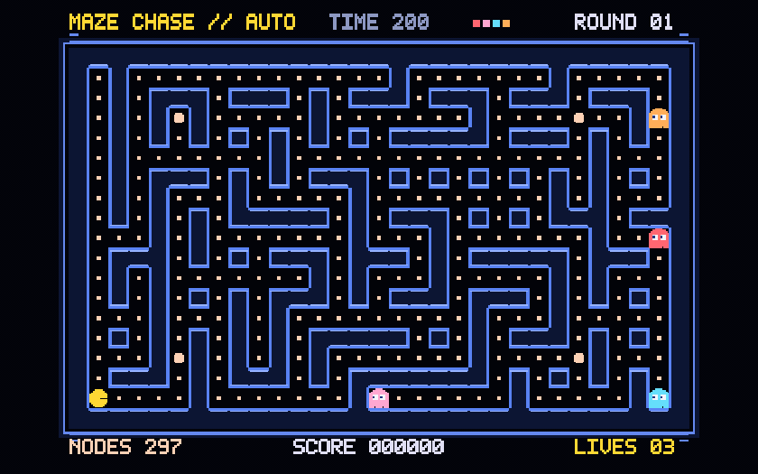
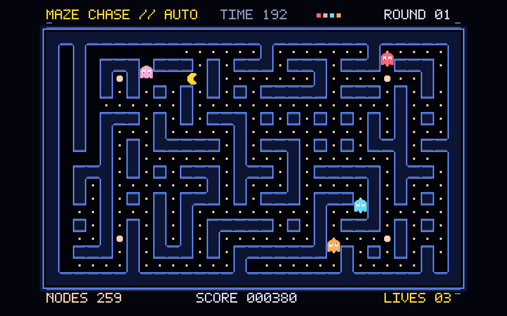
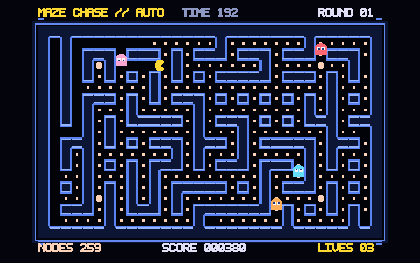
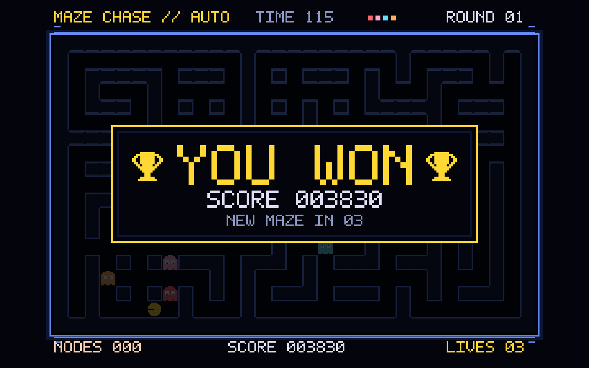
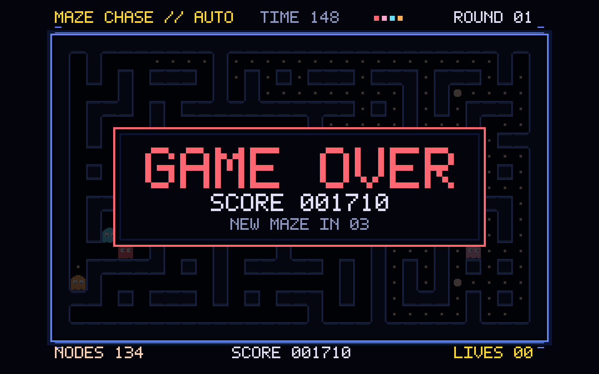

# Самоиграющий лабиринт

[Общая инструкция на русском](../README.ru.md) · [English README](../README.md) · [MIT](../LICENSE)

Быстрые команды из корня репозитория:

```sh
./scripts/build.sh pacman preview
./scripts/build.sh pacman
./scripts/check.sh pacman
./scripts/install.sh pacman
```

Скринсейвер в духе аркады с собиранием точек: жёлтый персонаж сам ищет путь через лабиринт, открывает и закрывает рот во время движения, собирает узлы и уходит от четырёх преследователей. После победы или поражения игра на несколько секунд показывает итог, затем начинает новую партию с другим лабиринтом. Пиксельные фигуры и карты рисуются кодом; проект не содержит игровых ассетов, логотипов, звуков или сетевых зависимостей.

## Партии и карты

Победа наступает после сбора всех точек: на экране появляется **YOU WON** с пиксельными кубками. После потери всех трёх жизней или истечения 200 секунд активной игры появляется **GAME OVER**. Итог виден около трёх секунд, затем начинается новая партия с новым счётом и новой картой.

Карта генерируется при запуске и после каждой партии. Сначала алгоритм проходит все комнаты и соединяет их в один лабиринт, затем добавляет дополнительные проходы; поэтому игровые клетки остаются связными. В проверке 2000 карт не нашлось недостижимых клеток; медианное время генерации на этом Mac — 0,28 мс. Генератор не работает каждый кадр. Лимит партии нужен на случай редкого затяжного поведения автопилота.

Баланс не предопределяет исход: призраки и автопилот играют по своим правилам на новой карте. В тесте 200 независимых партий получилось 75 побед (37,5%) и 125 поражений. Это ориентир для сложности, а не гарантия победы в каждой третьей партии.

## Поведение призраков

- **Красный** идёт к текущей клетке игрока.
- **Розовый** старается перехватить игрока впереди по его направлению.
- **Голубой** выбирает цель с учётом положения красного и направления игрока.
- **Оранжевый** догоняет издалека и уходит к своему углу, когда игрок близко.

Призраки чередуют погоню и движение к своим углам. После большой точки они замедляются, выбирают повороты случайнее и становятся уязвимыми. Поведение опирается на [исследование алгоритмов аркады](https://www.gamedeveloper.com/design/the-pac-man-dossier) и [описания персонажей Bandai Namco](https://pacman.com/en/character/). Процедурные карты, игровой темп и графика у этого проекта свои.



| Обычный экран | Маленький предпросмотр |
| --- | --- |
|  |  |

| Победа | Поражение |
| --- | --- |
|  |  |

## Сначала посмотрите предпросмотр

1. Откройте [Pacman.xcodeproj](Pacman.xcodeproj) в Xcode.
2. Выберите схему **AutoPacmanPreview** и устройство **My Mac**.
3. Нажмите **Run** (`⌘R`). Окно можно свободно изменять по размеру.
4. `⌘1` переключает на маленький предпросмотр 420×263, `⌘2` возвращает обычный размер, `⌃⌘F` включает полный экран.

Приложение и модуль `.saver` используют один и тот же `ScreenSaverView`, модель игры и код рисования в `Shared/`. Предпросмотр не требует предварительной установки заставки.

Если в терминале активны Command Line Tools, Xcode для сборки можно выбрать на одну команду:

```sh
DEVELOPER_DIR=/Applications/Xcode.app/Contents/Developer xcodebuild \
  -project Pacman/Pacman.xcodeproj \
  -scheme AutoPacmanPreview \
  -configuration Debug \
  -destination 'platform=macOS' \
  -derivedDataPath build/pacman \
  build
```

Команду запускайте из корня репозитория.

Для проверки игровой логики без запуска окна:

```sh
mkdir -p build
DEVELOPER_DIR=/Applications/Xcode.app/Contents/Developer xcrun swiftc -O \
  -module-cache-path build/PacmanModuleCache \
  Pacman/Shared/MazeGame.swift Pacman/Tools/TestMazeGame.swift \
  -o build/test-pacman-game
build/test-pacman-game
```

Тест проверяет связность и различие новых карт, завершение партий, паузу с результатом, лимит времени, долю побед и долгую непрерывную игру с преследователями.

Кадры для контроля размеров можно создать из настоящего `ScreenSaverView`:

```sh
DEVELOPER_DIR=/Applications/Xcode.app/Contents/Developer xcrun swiftc \
  -framework AppKit -framework ScreenSaver \
  -module-cache-path build/PacmanModuleCache \
  Pacman/Shared/MazeGame.swift Pacman/Shared/MazeArtworkView.swift \
  Pacman/Shared/AutoPacmanSaverView.swift Pacman/Tools/RenderSnapshots.swift \
  -o build/render-pacman-snapshots
build/render-pacman-snapshots
```

Снимки сохраняются в `build/pacman-snapshots/`: 420×263, 1440×900, 1920×1080, 2560×1080 и 900×1440.

Для покадровой проверки движения есть `Pacman/Tools/RenderAnimation.swift`. Он создаёт 72 кадра из того же view с фиксированной начальной картой; шестисекундная анимация выше собрана из этих кадров. `Pacman/Tools/RenderOutcomes.swift` создаёт снимки экранов победы и поражения из настоящих завершённых партий.

## Сборка модуля

```sh
DEVELOPER_DIR=/Applications/Xcode.app/Contents/Developer xcodebuild \
  -project Pacman/Pacman.xcodeproj \
  -scheme AutoPacman \
  -configuration Release \
  -destination 'generic/platform=macOS' \
  -derivedDataPath build/pacman \
  ARCHS='arm64 x86_64' \
  build
```

Результат: `build/pacman/Build/Products/Release/AutoPacman.saver`.

Для установки или обновления в своей учётной записи после просмотра:

```sh
mkdir -p "$HOME/Library/Screen Savers"
ditto build/pacman/Build/Products/Release/AutoPacman.saver \
  "$HOME/Library/Screen Savers/AutoPacman.saver"
```

Далее откройте **Системные настройки → Обои → Заставка** и выберите **«Самоиграющий лабиринт»**.
Если была установлена предыдущая версия, закройте и снова откройте Системные настройки после замены модуля. Текущая версия — `0.3.0`.

## Публикация

В Git достаточно хранить исходники, проект Xcode, этот README и снимок экрана. `build/`, `DerivedData/`, готовые `.app` и `.saver`, пользовательские настройки Xcode и ключи подписи исключены в корневом `.gitignore`. Перед публикацией бинарного выпуска для других пользователей понадобятся подпись Developer ID и нотариализация; эти учётные данные в репозиторий добавлять нельзя.
