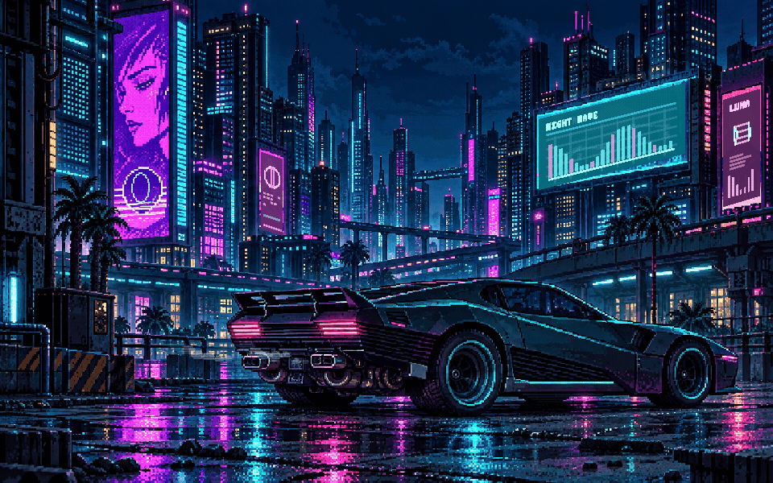

# Vibe Driven Screensavers

Four native macOS screen savers, with a separate Xcode preview app for each scene. Every preview uses the same Swift drawing and animation code as its installable `.saver` module.

[Русская инструкция](README.ru.md) · [MIT license](LICENSE)

The scenes run locally using AppKit and Apple's [Screen Saver framework](https://developer.apple.com/documentation/screensaver). No account, API key, network connection, video player or third-party package is needed at runtime.

## The collection

| Screen saver | Scene | Project key |
| --- | --- | --- |
| **Alarm Terminal** / Тревожный терминал | Retro emergency terminal, real local `HH:MM:SS`, segmented digits, discrete telemetry and four palettes | `terminal` |
| **Auto Pacman** / Самоиграющий лабиринт | Autonomous pixel arcade, four ghost personalities, connected random mazes and victory/defeat screens | `pacman` |
| **Pixel City** / Живой пиксельный город | A distant Moscow City inspired skyline, independent windows, weather, trains, occasional cars and a station clock | `city` |
| **Neon District** / Неоновый квартал | Cyberpunk pixel artwork, animated holographic billboards, a passing metro, car lighting and exhaust | `neon` |

### Alarm Terminal

The clock shows local time in 24-hour format. Telemetry markers move between scale divisions every five seconds. Choose amber, arctic, phosphor or violet in the preview's palette menu or the installed saver's Options.


[Scene guide](Terminal/README.md)

### Auto Pacman

The player navigates on its own, eats pellets and avoids four ghosts with different targeting rules. Each round gets a new connected maze. `GAME OVER` or `YOU WON` appears before restarting. Active rounds are limited to 200 seconds; difficulty varies to allow occasional wins, rather than enforcing an exact outcome sequence.


[Scene guide](Pacman/README.md)

### Pixel City

A fictional city panorama with silhouettes inspired by Moscow City. Windows follow independent schedules, clouds drift, rain comes and goes, and trains and cars pass with pauses. The station board shows real local `HH:MM`. The entire scene is drawn in code.


[Scene guide](City/README.md)

### Neon District

A layered neon city and a parked futuristic car, with independently changing animated advertisements, exhaust and intermittent metro traffic. The generated background is bundled locally; animation is drawn in Swift. Pixel City remains a separate saver.



[Scene guide](Neon/README.md) · [Artwork provenance and generation prompt](Neon/Resources/ARTWORK.md)

## Requirements

- A Mac and **full Xcode** with a macOS SDK. Command Line Tools alone cannot build these Xcode projects.
- The deployment target is **macOS 13.0**. Builds and checks have been exercised with **Xcode 27.0 / macOS SDK 27.0**; macOS 13 and Intel runtime behavior have not been independently tested.
- Saver builds contain both **Apple Silicon (`arm64`) and Intel (`x86_64`)**. Preview builds target the current Mac.

Open Xcode once after installing it to complete its setup. No Swift packages or other dependencies need to be downloaded.

## Get the source

```sh
git clone https://github.com/ThePigeonKing/vibe-driven-screensavers.git
cd vibe-driven-screensavers
```

All shell examples below start in the repository root.

## Preview first in Xcode

Open one of these projects, select the **preview scheme** and **My Mac** in the top toolbar, then press **Run (`⌘R`)**:

| Xcode project | Preview scheme | Saver scheme / installed filename |
| --- | --- | --- |
| [Terminal/AlarmTerminal.xcodeproj](Terminal/AlarmTerminal.xcodeproj) | `AlarmTerminalPreview` | `AlarmTerminal` / `AlarmTerminal.saver` |
| [Pacman/Pacman.xcodeproj](Pacman/Pacman.xcodeproj) | `AutoPacmanPreview` | `AutoPacman` / `AutoPacman.saver` |
| [City/PixelCity.xcodeproj](City/PixelCity.xcodeproj) | `PixelCityPreview` | `PixelCity` / `PixelCity.saver` |
| [Neon/NeonDistrict.xcodeproj](Neon/NeonDistrict.xcodeproj) | `NeonDistrictPreview` | `NeonDistrict` / `NeonDistrict.saver` |

For example:

```sh
open Neon/NeonDistrict.xcodeproj
```

The preview scheme launches a normal resizable window. The saver scheme builds a plug-in bundle and has no standalone app to run.

### Preview controls

| Shortcut | Action |
| --- | --- |
| `⌘1` | Compact 420×263 preview, including the saver's small-preview mode |
| `⌘2` | Restore the regular window size |
| `⌃⌘F` | Enter or leave full screen |
| `⌘3`…`⌘6` in Alarm Terminal | Change palette; saved for the installed saver too |
| `⌘0` in Pixel City | Resume natural weather changes |
| `⌘3`, `⌘4`, `⌘5` in Pixel City | Preview clear, cloudy or rainy weather |

Window resizing also works by dragging its edges. Pixel City's weather overrides apply to the preview only. Some menu labels and saver display names are currently in Russian.

## Build from the command line

The helper scripts accept `terminal`, `pacman`, `city`, `neon` or `all`.

```sh
# Build all four universal Release .saver modules.
./scripts/build.sh all

# Or build one scene.
./scripts/build.sh neon

# Build and open a Debug preview app.
./scripts/build.sh neon preview
open build/neon/Build/Products/Debug/NeonDistrictPreview.app
```

`./scripts/build.sh all preview` builds all four preview apps. Every helper also supports `--help`.

### Choosing Xcode

The scripts honor `DEVELOPER_DIR`. If `xcode-select` points to Command Line Tools and Xcode is installed at `/Applications/Xcode.app`, they use that Xcode for the current process. They do not change your global developer directory.

For another installation path, set it explicitly:

```sh
DEVELOPER_DIR=/Applications/Xcode.app/Contents/Developer ./scripts/build.sh all
```

The equivalent manual build for a single module is:

```sh
DEVELOPER_DIR=/Applications/Xcode.app/Contents/Developer xcodebuild \
  -project Neon/NeonDistrict.xcodeproj \
  -scheme NeonDistrict \
  -configuration Release \
  -destination 'generic/platform=macOS' \
  -derivedDataPath build/neon \
  ARCHS='arm64 x86_64' ONLY_ACTIVE_ARCH=NO \
  build
```

### Build outputs

| Project key | Release module |
| --- | --- |
| `terminal` | `build/terminal/Build/Products/Release/AlarmTerminal.saver` |
| `pacman` | `build/pacman/Build/Products/Release/AutoPacman.saver` |
| `city` | `build/city/Build/Products/Release/PixelCity.saver` |
| `neon` | `build/neon/Build/Products/Release/NeonDistrict.saver` |

Preview apps are in the same project's `Build/Products/Debug/` directory. Xcode's Run button may use its own DerivedData location; the install helper expects the paths produced by `scripts/build.sh`.

## Install and select a saver

Close System Settings before installing or updating. After building:

```sh
# Install all four for the current macOS user.
./scripts/install.sh all

# Or install only one.
./scripts/install.sh neon
```

The helper copies the modules to **`~/Library/Screen Savers/`**. It requires no `sudo`, checks that every requested build exists before copying, and updates an existing module with the same filename. It does not build the projects or clear quarantine attributes.

To copy a module manually:

```sh
mkdir -p "$HOME/Library/Screen Savers"
ditto build/neon/Build/Products/Release/NeonDistrict.saver \
  "$HOME/Library/Screen Savers/NeonDistrict.saver"
```

Reopen **System Settings**, search for **Screen Saver**, then choose the module under **Other**. Recent macOS versions place this under **Wallpaper → Screen Saver**; older versions have a separate Screen Saver pane. Use the system's Preview to check full-screen playback. See [Apple's Screen Saver settings guide](https://support.apple.com/guide/mac-help/change-screen-saver-settings-mchlp1227/mac).

To uninstall, choose another saver, close System Settings, open `~/Library/Screen Savers/` in Finder and move the relevant `.saver` to Trash.

### If macOS blocks a downloaded module

The projects disable code signing for local development. These builds are **not Developer ID signed or notarized**. A module built locally will normally have no download quarantine; a downloaded archive may have one. Follow [Apple's instructions for software from an unidentified developer](https://support.apple.com/en-us/102445), including Privacy & Security → Open Anyway when available.

If you have reviewed and trust this particular module, you can inspect and remove **only its quarantine attribute**:

```sh
xattr -lr "$HOME/Library/Screen Savers/NeonDistrict.saver"
xattr -dr com.apple.quarantine "$HOME/Library/Screen Savers/NeonDistrict.saver"
```

Substitute the exact module filename as needed. Removing quarantine does not sign or notarize a module. The installer never does this automatically.

If a saver does not appear or an older version keeps playing, quit and reopen System Settings. Check that you copied the `.saver` directory itself and built the matching saver scheme. If the system still caches an older module after updating, log out and back in.

## Repository structure

```text
Terminal/                   Alarm Terminal project and scene guide
Pacman/                     Auto Pacman project and scene guide
City/                       Pixel City project and scene guide
Neon/                       Neon District project and scene guide
  Resources/                Bundled artwork and its provenance

Each scene directory contains:
  *.xcodeproj/              Preview app + saver targets, shared schemes
  Shared/                   Drawing, animation model and ScreenSaverView
  Preview/                  Preview app entry point and window/menu controls
  ScreenSaver/              Saver Info.plist and bundle metadata
  Tools/                    Model checks, snapshot/animation renderers

Tools/VerifySaverBundle.swift  Common .saver loading check
scripts/                    Build, install and check helpers
docs/                       Committed screenshots and animated previews
build/                      Generated products and checks; ignored by Git
LICENSE                     MIT
```

Each project is independent. Adding or editing one scene does not require rebuilding the others. `Terminal/` was previously at the repository root; it now follows the same layout as the other projects.

## Customize or extend a scene

| What to change | Where to start |
| --- | --- |
| Terminal colors | [Terminal/Shared/TerminalTheme.swift](Terminal/Shared/TerminalTheme.swift) |
| Terminal layout and scale timing | `TerminalArtworkView.swift` and `TelemetryModel.swift` in `Terminal/Shared/` |
| Maze generation, player strategy, ghost behavior, round timing | [Pacman/Shared/MazeGame.swift](Pacman/Shared/MazeGame.swift) |
| Arcade drawing, sprites and result screens | [Pacman/Shared/MazeArtworkView.swift](Pacman/Shared/MazeArtworkView.swift) |
| City buildings and pixel palette | [City/Shared/CityArtworkView.swift](City/Shared/CityArtworkView.swift) |
| Windows, weather, trains and road traffic | [City/Shared/CitySceneModel.swift](City/Shared/CitySceneModel.swift) |
| Neon overlays, billboard geometry and smoke | [Neon/Shared/NeonArtworkView.swift](Neon/Shared/NeonArtworkView.swift) |
| Neon billboard and metro schedules | [Neon/Shared/NeonAnimationModel.swift](Neon/Shared/NeonAnimationModel.swift) |

Edit `Shared/`, run the preview, check compact and full-screen layouts, then rebuild and reinstall the saver. The wrappers in `Shared/*SaverView.swift` handle the macOS animation lifecycle. The two clock scenes use the current local time; fixed clocks in snapshot tools are only for reproducible pictures.

To add a scene, follow an existing project's two-target layout. Give a new saver its own bundle identifier and principal class, share its drawing code with its preview app, commit both shared schemes, and add its mapping to `scripts/common.sh` and checks to `scripts/check.sh`. Keep artwork resources in both targets where needed. Existing identifiers are retained so upgrades preserve saved preferences.

## Checks and rendering tools

```sh
# Run model checks for all scenes, then load any built Release modules.
./scripts/check.sh all

# Or check one scene.
./scripts/check.sh pacman
```

Checks cover telemetry bounds and timing, connected maze generation and autonomous outcomes, long city/weather/traffic simulations, and neon billboard/metro schedules including recovery after time jumps. Bundle checks load each built module and verify that its principal class derives from `ScreenSaverView`. Build modules first to include this part of the check; otherwise it is explicitly skipped.

Each scene's `Tools/` also contains renderers for screenshots and animation frames. For example, render the terminal in four palettes at five aspect ratios:

```sh
mkdir -p build
DEVELOPER_DIR=/Applications/Xcode.app/Contents/Developer xcrun swiftc \
  -parse-as-library -framework AppKit -framework ScreenSaver \
  -module-cache-path build/module-cache \
  Terminal/Shared/*.swift Terminal/Tools/RenderSnapshots.swift \
  -o build/render-terminal
build/render-terminal
```

The PNGs appear in `build/snapshots/`. The scene guides describe additional renderers and benchmarks. Generating a GIF from rendered frames requires a separate encoder such as FFmpeg; it is optional and is not a screen saver dependency.

Model checks, bundle loading and offscreen rendering do not replace checking the installed module in macOS's ScreenSaverEngine. Test compact preview, full screen, resizing and sleep/resume on the Mac you intend to use. The repository's checks do not certify every OS release or display configuration.

## What belongs in Git

Commit Swift source, Xcode projects and **shared** schemes, docs, and required artwork. `Neon/Resources/neon-district.png` is a source asset needed to build both targets. The supplied game screenshot used as its visual reference is not included.

[.gitignore](.gitignore) excludes build products, `.app`/`.saver` bundles, debug symbols, archives, logs, Xcode `xcuserdata`, editor/assistant state, `.env` files, signing keys and provisioning profiles. Keep credentials and your private signing configuration outside the repository. An ignore rule cannot remove something already committed: review `git diff --cached` before publishing.

For a downloadable binary release, package the `.saver` separately from source. To distribute a build with a verifiable macOS developer identity, follow Apple's [Developer ID](https://developer.apple.com/developer-id/) and [notarization](https://developer.apple.com/documentation/security/notarizing-macos-software-before-distribution) workflows. No signing credentials are included here.

## License and artwork

The repository is available under the [MIT license](LICENSE). Keep the copyright and license notice when redistributing it.

Alarm Terminal, Auto Pacman and Pixel City draw their visuals in code. Neon District uses AI-generated artwork; its provenance and exact prompt are documented in [ARTWORK.md](Neon/Resources/ARTWORK.md). No original game graphics, logos or reference screenshots are bundled. This is an independent hobby project, with no affiliation with the games or other works that inspired it. The license does not grant rights to third-party trademarks.
