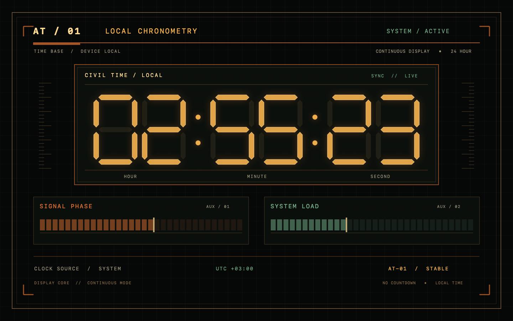
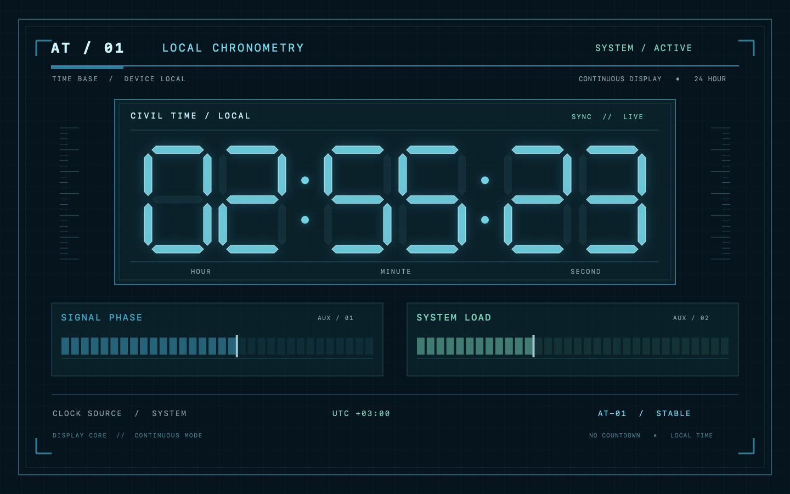
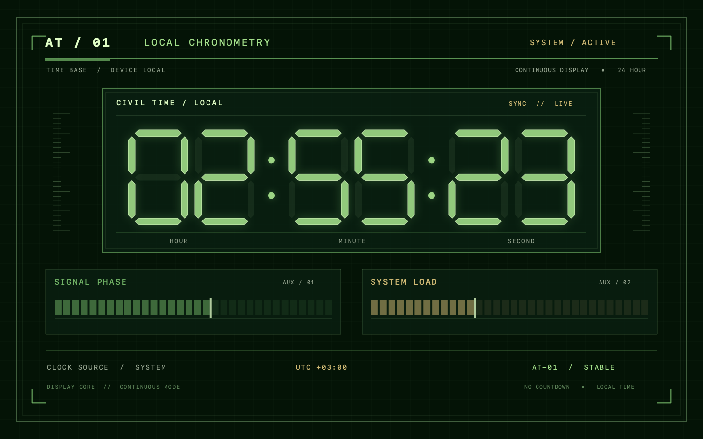
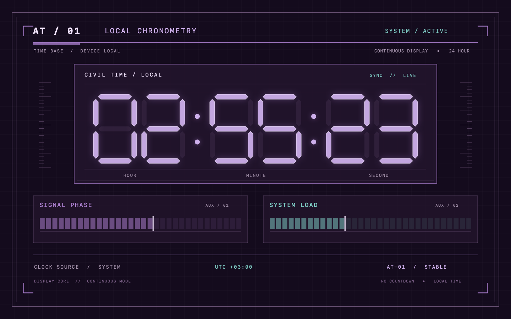

# Тревожный терминал

Вымышленная аварийная панель: крупные сегментные цифры показывают настоящее местное время **ЧЧ:ММ:СС**, рамки, деления шкал и небольшие технические надписи дополняют композицию. Мягкое свечение и спокойная анимация рассчитаны на длительный просмотр.

Маркеры **Signal Phase** и **System Load** стоят на разделителях шкал и меняют положение раз в пять секунд. Модель использует случайные переходы с ограничением границ; движение не сводится к проходу вперёд-назад.

## Палитры

| Янтарная | Полярная |
| --- | --- |
|  |  |
| Фосфорная | Сумеречная |
|  |  |

## Предпросмотр

1. Откройте [AlarmTerminal.xcodeproj](AlarmTerminal.xcodeproj).
2. Выберите **AlarmTerminalPreview → My Mac** и нажмите **Run (`⌘R`)**.
3. Растягивайте окно, используйте `⌘1` для маленького предпросмотра, `⌘2` для обычного окна и `⌃⌘F` для полного экрана.
4. В меню **Палитра** выберите схему (`⌘3`…`⌘6`). Выбор сохраняется для установленного модуля; его также можно изменить через параметры заставки в macOS.

Предпросмотр и `.saver` используют один `ScreenSaverView` и общий код из `Shared/`.

## Сборка, проверка и установка

Из корня репозитория:

```sh
./scripts/build.sh terminal preview
open build/terminal/Build/Products/Debug/AlarmTerminalPreview.app
./scripts/build.sh terminal
./scripts/check.sh terminal
./scripts/install.sh terminal
```

Результат: `build/terminal/Build/Products/Release/AlarmTerminal.saver`. О выборе Xcode, установке, настройках macOS и карантине см. [общую инструкцию](../README.ru.md).

Минимальная версия в настройках сборки — macOS 13.0; запуск на этой версии отдельно не проверялся. Релиз содержит `arm64` и `x86_64`.

## Снимки и изменение сцены

Снимки четырёх схем на пяти размерах можно создать без окна. Команды выполняются из корня репозитория:

```sh
mkdir -p build
DEVELOPER_DIR=/Applications/Xcode.app/Contents/Developer xcrun swiftc \
  -parse-as-library -framework AppKit -framework ScreenSaver \
  -module-cache-path build/module-cache \
  Terminal/Shared/*.swift Terminal/Tools/RenderSnapshots.swift \
  -o build/render-terminal
build/render-terminal
```

Снимки появятся в `build/snapshots/`: 420×263, 1440×900, 1920×1080, 2560×1080 и 900×1440. Инструмент использует настоящий `ScreenSaverView`, включая малый предпросмотр. Он не проверяет системный ScreenSaverEngine.

- `Shared/TerminalTheme.swift` — четыре палитры и сохранение выбора.
- `Shared/TerminalArtworkView.swift` — композиция, цифры, рамки и свечение.
- `Shared/TelemetryModel.swift` — интервалы и позиции шкал.
- `Shared/AlarmTerminalSaverView.swift` — жизненный цикл и параметры модуля.
- `Tools/TestTelemetry.swift` — проверка пятисекундных шагов, границ и восстановления после пауз.

Проект распространяется по [MIT](../LICENSE). Личные настройки Xcode и результаты сборки исключены в корневом [.gitignore](../.gitignore).
